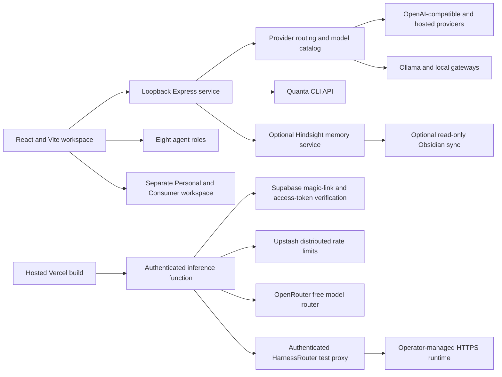

# Quanta OS — Project Summary

**Product:** Quanta OS / Sovereign SI<br>
**Positioning:** Brain · Hands · Nervous System · Governess<br>
**Form:** Local-first AI workspace and operator control plane<br>
**Primary checkout:** `C:\QuantaCore`<br>
**Local web app:** `http://127.0.0.1:3000`

## Purpose

Quanta OS organizes model providers, task-specific agent roles, memory integrations, and human review in one local workspace. It supports personal, consumer, business, trading research, education, guest, investing, and personal-growth workflows. Agent instructions help shape responses; they do not grant permissions. Trading and external actions require explicit human control.

## Architecture



The compatible-provider store protects API credentials on the local host (Windows DPAPI; AES-GCM with a local key on other platforms). Provider requests go to the selected endpoint. The legacy direct Gemini client reads the user-entered key from browser local storage and calls Google from the browser. Quanta no longer injects keys into the web bundle. OpenMuse has a separate service, identity, workspace, and provider configuration; Quanta’s launch hub does not transfer its credentials or session.

## Current capabilities

- React 19 and Vite user interface with the original Mission Control and a separate blue Agent Control Plane.
- Eight configurable agent roles: Personal, Consumer, Business, Trading, Education, Guest, Investing, and Personal Growth.
- Configurable provider connections for Gemini, OpenAI-compatible APIs, Ollama Local and Cloud, OpenRouter, Fireworks AI, OmniRoute, Groq, and Novita.
- Local model proxy and catalog discovery; provider settings persist outside browser bundles.
- CLI for local status, agent/provider catalogs, model listing, coding-harness guidance, and explicit model prompts.
- Neural Core architecture visualization and whitepaper content for Hindsight memory, evidence, observations, and synthesis.
- Sovereign Trust content and an opt-in Obsidian sync container definition.
- OpenMuse launch/status hub for the Personal and Consumer roles.
- **Gnoesis SI Harness Router** control surface with local Docker and authenticated hosted-browser modes, bounded single-turn test runs, and requested/served model reporting. The hosted mode requires a reachable HTTPS HarnessRouter, Supabase server secrets, and explicit read-only harness/model allowlists. Jev triage and model-strength scoring remain evaluation work until validated.
- Supabase Edge Function hosted demo with verified Supabase sessions, shared Upstash account/IP throttles, text/input limits, and a fixed OpenRouter free model route. Vercel serves the static frontend only.

## Integration status

| Integration | Status |
| --- | --- |
| Quanta web app and loopback API | Running locally on port 3000. |
| GitHub, Vercel, Supabase | `main` deploys the static Vite application to Vercel. The authenticated `quanta-inference` Edge Function source targets Supabase project `ovugynuxvtvfkwjkyxby`; deploy it with the Supabase CLI and add OpenRouter and Upstash secrets in Supabase Function Secrets. |
| Provider connections | Configurable from Settings; API keys are stored by the local server. |
| CheaperInference | Compatible through the OpenAI-compatible provider using `https://api.cheaperinference.com/v1` and an exact provider model ID. |
| OpenMuse | Separate checkout at `C:\GnoesisOpenMuse`; API on 8787 and web UI on 8081. Sample workspace data and model-backed chat are available. Quanta roles and identity are not automatically passed into OpenMuse. |
| Hindsight | Docker Compose service is defined; health and inference depend on local configuration and provider credentials. |
| Gnoesis SI Harness Router | Local Docker runtime is healthy on `127.0.0.1:3100`. The QuantaCore page now offers local and authenticated hosted-browser test modes. Hosted execution is fail-closed until an HTTPS HarnessRouter endpoint, server API key, read-only harness/model allowlists, and function secrets are configured. See [integration plan](docs/GNOESIS_SI_HARNESS_ROUTER.md). |
| Obsidian | Optional read-only sync profile. A private, machine-specific vault mount is required. |
| FPT-Omega router | Shown as a conditional target in the architecture. Production routing into Hindsight is not yet implemented or validated. |
| FireRouter, Nexus, Finetune RL | Landing-page showcase only; Quanta does not manage these services or training jobs. |
| OpenMuse browser and computer workers | Optional and not configured in the current local setup. |

## Local operation

```powershell
npm ci
npm run dev
```

Open `http://127.0.0.1:3000`. Optional build and type-check commands are `npm run build` and `npm run lint`. The CLI starts with `node bin/quanta.mjs help`. Its `ask` command sends a model request and can incur provider charges.

Optional memory services start with `docker compose up -d`. Obsidian sync requires the local ignored mount file and the `obsidian` Compose profile. See [README.md](README.md) for setup details.

## Product and security boundaries

- The Quanta UI server binds to loopback. Keep local services and their ports private unless you intentionally configure a secured deployment.
- The Vercel demo is a separate hosted mode: Supabase verifies bearer sessions, Upstash applies 10 requests/minute and 120/day per user plus 30/minute per IP, and hosted inference fixes the model to `openrouter/free` with an 800-token output cap. Its required environment variables are documented in `.env.example` and README. Prompts pass through Vercel to OpenRouter and upstream model providers; do not submit confidential material.
- The OpenRouter secret belongs only in the Vercel server environment and the ignored local `.env`; never use a `VITE_` prefix for it. The Supabase anon key is public; do not substitute a service-role key.
- Keep compatible-provider credentials in the local protected provider store and out of Git. The direct Gemini key is browser-side local storage, so use that path only in a trusted local browser.
- The checked-in Obsidian mount overlay is machine-specific and excluded from Git.
- The OpenMuse launch hub is not an identity bridge. It provides starter prompts and links; users review and submit work in OpenMuse.
- Hosted HarnessRouter runs require a signed-in Supabase user, an allowed origin, Upstash limits, and operator-owned HTTPS endpoint/key secrets. Hosted test runs allow only configured harness/model IDs and cap prompts, output, steps, and time. The local and hosted modes do not grant trading or money movement authority.
- A diagram, whitepaper, sample workspace, or status badge is not proof of a live model, active Memory Defense policy, working vault sync, or production FPT-Omega routing.
- Harness/model compatibility and candidate descriptions are not evidence of task quality. The Gnoesis SI Harness Router evaluates candidates by harness × model × task class; Jev confidence is not trusted until calibrated against held-out, adjudicated cases.
- Financial analysis is research support. The agent roster does not enable order placement or money movement.

## Immediate engineering priorities

1. Pass a clearly labeled Personal or Consumer role into OpenMuse through an explicit, reviewable context contract.
2. Decide whether to configure OpenMuse’s optional Chromium and isolated Docker computer workers.
3. Implement and validate the conditional FPT-Omega routing adapter, with evidence and failure handling, before describing it as active.
4. Keep FireRouter, Nexus, and RL capabilities labeled as roadmap until Quanta controls and verifies their runtime behavior.
