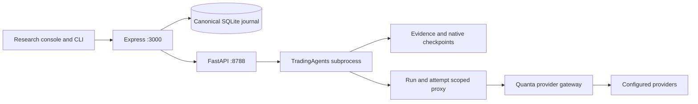

# Gnoesis Agenic Research

QuantaCore + TradingAgents, installed locally at `C:/QuantaCore`.

## Start

Node 22.23.2 and Python 3.11.15 were used for verification. The installed environment is `trading/.venv`; `uv.lock` pins TradingAgents v0.5.1 to the exact tag commit `35543d0248bf89fcb92b17a15858ad0c0e940687`. An upstream branch with the same version name points elsewhere.

```powershell
Set-Location C:\QuantaCore
npm run build
npm start
```

Open `http://127.0.0.1:3000/#/research`. The server starts the authenticated Python worker on 8788. OpenMuse keeps 8787. Development uses `npm run dev`.

To recreate dependencies:

```powershell
Set-Location C:\QuantaCore
npm ci
Set-Location trading
uv sync --frozen --python 3.11
```

On this machine uv is also available at `%LOCALAPPDATA%/hermes/bin/uv.exe`. Cold imports can take longer than the first readiness check; Refresh services rechecks. Configure a compatible model in Model settings. Browser-native Gemini does not use the research gateway.

## Use

1. Choose a stock/date, configured deep/quick models, analyst roles and rounds.
2. Set call/token/output/time limits, an optional known-price USD cap and optional manual portfolio JSON.
3. Review cost and limits, then explicitly approve. Configuration edits invalidate the estimate.
4. Inspect actual role/tool activity, reports, warnings and evidence before interpreting a rating.
5. Cancel or resume interrupted work. Resume keeps the original request and remaining call/token/cost budget; each active attempt has its time cap.
6. Download full Markdown/JSON. Use the ledger for prior versions and outcome provenance.

Settle through today is available for a ready research decision from an earlier date. Native holding-period/price rules determine which outcomes settle. Outcome annotations and reflections preserve source, benchmark, effective date and observation time. A reflection is an interpretation of evidence.

Evaluation is an independent decision grid, without executable fills, fees or a cash portfolio. The UI limits new grids to 12 cells; the API caps grids/queued work at 50. Failure and review cells remain visible. No historical performance or alpha claim is made.

## Architecture



Express is the sole durable owner. A transactional database lock prevents another live instance from reconciling its runs; ownership is acquired after successful binding. Interrupted work becomes an explicit error on restart. Python owns ephemeral subprocesses; cancellation and owner watchdogs stop orphan graph/service processes.

The adapter executes the actual compiled graph with its native state, run configuration, checkpoint, recording and report lifecycle. Twelve logical roles have real callbacks. Native checkpoints use a stable run-specific request-hash namespace; attempt artifacts stay separate. Resumed decisions retain hash-verified prior evidence and saved structured outputs.

Each run gets a UUID, frozen request, model routes, quoted rates, source revision and configuration hash. Same-day repeats remain distinct; idempotent retries return the originally frozen run or batch. Grid creation is atomic.

The JSON Schema is shared by AJV and Python jsonschema. Calendar dates, finite numbers, stock identifiers, configured qualified models and supported events receive additional validation. Replayable SSE uses per-run sequence IDs, Last-Event-ID and backpressure handling. Historical terminal events do not truncate later attempts or settlements.

## Security, budgets and data

Upstream provider keys stay in Quanta's encrypted store. Python receives separate local service and research credentials. The research credential is rejected without an active run/attempt. All graph/parser/reflection model calls use budget admission. Calls reserve conservative input/output tokens and quoted cost before provider access; missing usage remains conservatively charged and labeled estimated. Quotes exclude vendor fees and provider adjustments. Unknown cost is never zero.

The UI and worker bind loopback. Hosted research requests are blocked. Generic Council features remain elsewhere; Edge telemetry is labeled SIMULATED. The native Windows runtime is verified. A research container topology is outside this release; optional Redis/Memgraph services use Docker's memory profile and Memgraph Lab uses loopback 3010.

Tool responses retain vendor, query, as-of date, fetch time, hash, outcome and sanitized error identifier. Essential-price gates reject missing, stale, future and non-finite data. Unsupported conclusions terminate in REVIEW/data_insufficient. Structured native output is retained when available; rendered fallback is labeled and unsupported numeric fields remain null.

Native memory is a derived run-local projection. Only eligible research decisions/outcomes known by the requested date are seeded. Evaluation and fixtures do not change live memory. Models can contain later knowledge, and online feeds can be revised; historical runs are not point-in-time validation.

## CLI

```powershell
node bin/quanta.mjs trading health
node bin/quanta.mjs trading status
node bin/quanta.mjs trading decisions --ticker AAPL
node bin/quanta.mjs trading run --ticker AAPL --date 2026-09-28 --deep openrouter/openrouter/free --calls 60 --tokens 200000 --seconds 900 --confirm
node bin/quanta.mjs trading cancel RUN_ID
node bin/quanta.mjs trading resume RUN_ID
```

The model is an example; select an actually configured route. `--quick` defaults to deep; `--usd` requires known rates. Run `node bin/quanta.mjs trading` for evaluation/estimate syntax. Other ports use QUANTA_LOCAL_URL for the CLI and QUANTA_PORT for the server.

## Files and operations

- `data/trading/research.sqlite`: canonical events, derived runs, idempotency, grids, owner lock and budget accounting.
- `data/trading/runs/<run_id>/attempts/<attempt>/`: raw evidence/indexes, native reports, decisions and private errors.
- `data/trading/runs/<run_id>/checkpoints/<request_hash>/`: native resume state and saved structured outputs.
- `contracts/research.schema.json`: shared schema; generate types with `npm run research:types`.

Triggers forbid event updates/deletes; a hash chain and journal projection snapshots detect ordinary application-level mutation. This does not prevent an administrator replacing the whole database. Preserve corrupt artifacts for inspection. Do not replace canonical history with mutable native memory.

Independent verification uses a separate GNOESIS_DATA_DIR and port. External service mode requires matching GNOESIS_SIDECAR_URL, GNOESIS_SERVICE_TOKEN and GNOESIS_GATEWAY_TOKEN; these local credentials are distinct from upstream keys. Default managed mode creates scoped credentials automatically.

## Verification and limits

- TypeScript and production build passed; the existing large-bundle warning remains.
- Research service/backend tests: 12 passed. Existing inference router: 6 passed.
- Python worker: 18 passed, including the actual 12-role graph with synthetic LLM/data inputs, structured outputs, native recording, checkpoint recovery and retained evidence.
- Real HTTP fixture workflow: single run, replay/idempotency, 12 grid cells and cancellation passed, with zero provider calls.
- Scoped gateway, atomic budget admission, stale attempts, cancellation handoff, large SSE replay, owner lock, projection tamper and owner-death cleanup checks passed.
- Local UI rendering was captured. Further interactive computer use was stopped by the user; the full browser interaction checklist is unverified.

`node scripts/verify-research-workflow.mjs` runs only against an isolated server explicitly configured with GNOESIS_TEST_MODE=1. Normal mode rejects fixtures. A grid proves workflow mechanics, not trading performance. No real provider prediction or profitable edge is claimed. Cold-import latency targets from the original draft are unverified.

For a future edge study: freeze data and decision cutoffs; compare identical inputs with a simple benchmark; measure each role through ablation; use a blinded critic and independent outcome source; reserve a temporal holdout; model executable costs before proposing execution.
