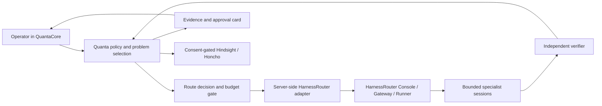

# Gnoesis SI Harness Router — QuantaCore integration plan

**Prepared:** 2026-09-29

**Status:** approved local pilot installed; hosted-browser path implemented for an authenticated Supabase Edge Function. The local runtime is healthy, but neither local nor hosted model credentials are configured, so no model run has been made. Hosted mode remains unavailable until its HTTPS endpoint, server key, and allowlists are configured and the function is deployed.
**Local source:** HarnessRouter clone at `C:\Users\jeffg\Documents\Codex\2026-09-29\https-github-com-gusthetrader-harnessrouter\work\harnessrouter`, commit `463e02c094d0b6f240959c3395b468884f9d7bbb`. QuantaCore working branch: `feature/gnoesis-si-harness-router`, based on `61ae152f310ce79011701ebe2d89d6a647c6e2ee`. The image is being built from that source. No HarnessRouter API key or model provider is configured.

## Approved local pilot status

- Product name: **Gnoesis SI Harness Router**; local landing-page entry opens QuantaCore's new control surface.
- QuantaCore owns problem selection, policy, consent, and approvals. HarnessRouter is the local execution runtime at `127.0.0.1:3100`.
- Quanta's server validates the HarnessRouter API key before storing it in the existing protected credential vault; the browser does not persist it.
- The landing-page card is available in local and hosted QuantaCore. Hosted mode uses an authenticated Supabase server-side adapter and requires an operator-managed HTTPS HarnessRouter; it never points a Vercel browser at a user's loopback service.
- Initial container scope is System One/Jev plus Hermes. No provider-backed run has been enabled, and no paid model evaluation has been run.
- Live check: the container reports `healthy` and answers UHP discovery on `127.0.0.1:3100`; QuantaCore's `/api/harness-router/status` reports `reachable: true` and `apiKeyConfigured: false`. This verifies service discovery and the status path only, not a model execution.
- The hosted browser function accepts only status, catalog, and one-turn test actions. It requires a signed-in Supabase user, an allowed origin, Upstash rate limits, a server-side HTTPS endpoint/key, and explicit allowlists for read-only test harnesses and models. Runs cap input at 3,000 characters, output at 512 tokens, steps at two, and elapsed time at 45 seconds.
- The hosted UI code is not a live cloud runtime by itself. The local Docker service is loopback-only; a separately reachable HTTPS HarnessRouter and Supabase Function Secrets are required for browser runs.
- The service is bound to loopback. Rotate the upstream default Console password before exposing it beyond this machine; create a HarnessRouter API key and configure a provider before testing a read-only model run.
- Jev classification and harness × model × task-class strength scoring are displayed as planned evaluation layers; neither is represented as operational yet.

Build the image with `integrations/harnessrouter/build-local.ps1 -SourcePath <clone-path>`. The helper checks the exact source commit, normalizes Docker shell scripts from CRLF for Linux, applies the recorded patch only during the build, and restores the clone afterward. The patch is small: Google Fonts no longer accepts the upstream build's requested 100–900 Schibsted Grotesk range, so the image uses supported 400–900 weights. The original clone commit remains the source baseline and the change is isolated and reviewable.

## Decision

Use **HarnessRouter as the execution control plane** for harness lifecycle, model availability, sessions, streams, files, cancellation, and execution traces. Keep **QuantaCore as the operator control plane** for user intent, domain policy, problem selection, approvals, memory consent, and result presentation. Add a small server-side adapter and a measurable routing policy between them. Start with a local pilot, then decide how to deploy a hosted route. This avoids treating an OpenAI-compatible chat proxy as if it had agent session semantics.

The proposed **Superintelligence Harness** is a governed workflow, not a claim that one model is superintelligent: frame the problem, select specialists, run bounded tasks, verify their evidence independently, synthesize a decision card, and hand any consequential action to the operator. Its quality must be demonstrated on QuantaCore tasks before promotion.

## Current-state evidence

| Area | Verified in checkout | Integration consequence |
| --- | --- | --- |
| Quanta local API | `C:\QuantaCore\eve.ts:20-29` mounts inference, research, CLI, and memory routes on loopback port 3000. `server/inference-router.ts:119-197` proxies Chat Completions to a chosen provider. | Add a separate HarnessRouter adapter. Do not overwrite the existing provider proxy during the pilot. |
| Quanta agent UI | `components/AgentControlPlane.tsx:34-36,147-201` stores threads in browser storage and runs plan → draft → review through `chatWithSME`. `:171-185` pins the same provider and model for the run. | Introduce durable run IDs and HarnessRouter session mapping; show route and verification evidence. A second pass by the same model is critique, not independent validation. |
| Quanta hosted path | `supabase/functions/quanta-inference/index.ts` authenticates hosted text inference; Vercel serves the static Vite UI. `supabase/functions/quanta-harness-router/index.ts` now adds a separate authenticated, rate-limited browser proxy for bounded HarnessRouter tests. | The proxy needs a TLS-reachable HarnessRouter endpoint and server-side API key. The local `127.0.0.1` service is never exposed to Vercel. |
| HarnessRouter API | `protocol/versions/2026-09-28/tasks.md:11-40,63-106` specifies `POST /v1/responses`, `metadata.harness_id`, `previous_response_id`, and explicit model substitution. `gateway/app.py:7930-8036` implements selection and model policy. | Pin an actual harness ID and requested model per run; verify the served model and fallback metadata before scoring. |
| HarnessRouter capability | `gateway/app.py:15130-15150` defines harness config, tool exclusions, budgets, environment, and optional `calibrates`. `docs/environments.md:18-49` defines read-only project environments with private session workspaces. | Use versioned, read-only task environments and narrow tools. Keep the calibration feature in an isolated experiment because it can publish an inner harness configuration. |
| HarnessRouter evaluation | `scripts/benchmark/README.md:8-76` measures task grading, latency, tool failures, tokens, and served model. `docs/benchmark.md:7-12` reports a SpreadsheetBench slice only. | The existing benchmark and support matrix show feasibility, not the best model for QuantaCore's research or trading tasks. Build domain-specific evaluations. |

## Functional contract

1. **Intake and problem choice.** Turn an objective into a small set of candidate problems. Record expected decision value, uncertainty that can be reduced, evidence required, time sensitivity, cost, and potential harm. Recommend the most useful *tractable* next problem, with alternatives and assumptions visible. The operator can choose another problem. No agent-generated priority score is treated as ground truth.
2. **Route eligibility.** Filter candidate harness × model pairs by actual `available` status, tool/data permissions, task type, context size, budget, and session continuity. Quanta's policy rejects routes that cannot satisfy a required capability. HarnessRouter's catalog is the execution source of truth; compatibility labels alone are insufficient.
3. **Route selection.** On eligible routes, optimize expected **verified task utility** subject to hard cost, latency, and risk limits. Start with hand-authored rules. Use per-task evidence later: success rate with uncertainty bounds, cost, duration, and tool failure rate. Expose the route reason, alternatives, requested model, served model, and any fallback. A substituted model invalidates a benchmark run; for consequential tasks, fail closed or require a new operator choice.
4. **Execution.** Submit a Responses task with `metadata.harness_id`, explicit model, `max_step`, `timeout_seconds`, idempotency key, and a Quanta correlation ID. Persist `response_id`, `session_id`, chosen harness/model, budget, user scope, and status server-side. Continue with `previous_response_id`; do not recreate the entire chat transcript as an unbounded prompt. Map stream events and `incomplete`/error/cancel states to Quanta's UI. Quanta's Stop control calls HarnessRouter's cancel endpoint and verifies terminal status.
5. **Superintelligence workflow.** Begin with three bounded roles: a planner that specifies testable claims, a specialist that uses only the tools required for the task, and a verifier that checks artifacts, provenance, calculations, and missing evidence without relying on the specialist's self-rating. A synthesis step produces an evidence card with agreement, disagreement, unresolved questions, and next experiment. Escalate only when expected benefit justifies another model call; cap calls, steps, tokens, time, and spend per problem. Preserve each role's prompt/config version and trace.
6. **Human authority.** Trading roles stay research-only by default. Do not give agent harnesses order, wallet, transfer, or broker credentials. Any future financial execution needs a separate policy service and explicit, order-specific approval outside the agent runner. External messages, purchases, deployment, and destructive changes require their own approval gate. Tool limits must be enforced by server/API permissions and sandbox boundaries, not only instructions.

## Agent and harness candidates

These are distinct product types, not contestants for one overall winner. The fit statements below capture the operator's starting hypotheses; official project pages establish advertised shape, while QuantaCore evaluation establishes whether a candidate works for our tasks. Agent compatibility also needs a real adapter: a UI or channel gateway is not automatically a HarnessRouter model or runner.

| Candidate | Kind and proposed role | QuantaCore / HarnessRouter treatment |
| --- | --- | --- |
| [Hermes](https://github.com/NousResearch/hermes-agent) | Long-running personal/work runtime; proposed primary analyst and orchestrator for the first pilot. | HarnessRouter already has a Hermes backend. Evaluate tool discipline, delegation, memory writes, cost, and results on Quanta cases. Hermes has its own persistent memory; test whether that duplicates opt-in Hindsight/Honcho context before enabling both. |
| [OpenClaw](https://github.com/openclaw/openclaw) | Self-hosted channel and gateway layer for messaging access. | Keep as an optional interaction/channel integration. Do not score it as a reasoning model; connect its agent execution through a supported API/protocol adapter and preserve its gateway scopes. |
| [CopilotKit OpenBot](https://github.com/CopilotKit/OpenBot) | Governed coworker surface with per-agent computer and tool/browser actions mediated by policy and recorded. It accepts agents speaking AG-UI. | Consider only if Quanta needs a separate browser/computer workspace with action review and human takeover. Compare its governance boundary with HarnessRouter's runner isolation and tool policies; it is a different layer and currently marked alpha by its project. |
| [CopilotKit OpenMuse](https://github.com/CopilotKit/OpenMuse) | Personal-agent app with a visible computer and durable task/activity experience; described as compatible with agent harnesses. | Evaluate as a possible user-facing work surface, not as a base model. Keep its alpha status and live connector permissions in scope. **This is separate from QuantaCore's existing Gnoesis OpenMuseAgent/OpenMuse integration**; keep distinct IDs, repos, credentials, and status in any registry. |
| [OpenHuman](https://github.com/tinyhumansai/openhuman) | Personal context, local-first memory, orchestration, and durable workflows. | Evaluate its actual storage, model routing, connector permissions, and export/deletion behavior before loading personal data. Its repository labels the project early beta. |
| [NanoClaw](https://github.com/nanocoai/nanoclaw) | Container-oriented agent sessions and channel integrations; a candidate when isolation is the main requirement. | Review mounts, network, credential proxy, and session teardown, then test whether it can be wrapped behind the Quanta/HarnessRouter contract. Do not infer isolation guarantees from the word “container.” |
| [IronClaw](https://github.com/nearai/ironclaw) | Security-oriented runtime with sandboxed tools and capability controls. | Security architecture candidate for a restricted worker. Verify the specific build/configuration, integrations, and operational boundary before treating its claims as controls Quanta inherits. |
| [ZeroClaw](https://github.com/zeroclaw-labs/zeroclaw) | Rust-based, resource-conscious personal-assistant runtime with an OpenClaw migration path. | Keep as a portability/runtime challenger. Test migration on a copy and dry-run first; benchmark its task quality and actual resource use on our hardware. |
| [PicoClaw](https://github.com/sipeed/picoclaw) and [NullClaw](https://github.com/nullclaw/nullclaw) | Small-footprint runtimes aimed at constrained devices and edge deployment. | Defer as desktop research defaults. Revisit for a small worker or edge node; reproduce resource measurements on target hardware and audit security and tool boundaries first. PicoClaw's own repository warns it is under rapid development and not a production choice before v1.0. |

**Naming rule:** use explicit registry IDs such as `openmuse-copilotkit` and `openmuse-gnoesis`. Store repository URL, commit/release, license, adapter type (`UHP`, `AG-UI`, API, or CLI), capability policy, lifecycle status, and last verification date. This prevents a name collision from silently routing a task to the wrong project.

## Jev classifier and model strength registry

HarnessRouter's `systemone` backend runs the System One Harness over Jev. Its driver selects from a finite set of typed actions and returns structured decisions; it is not a general-purpose text or deep-research model. Use Jev as a **bounded task triage/classifier** if the live adapter test supports the required schema:

- Input: a minimized task card (objective, allowed data class, deadline, risk class, budget, available routes and capabilities). Treat attachments and retrieved memory as data, not instructions.
- Output: schema-validated `task_class`, `required_capabilities`, `risk_tier`, `effort_tier`, `candidate_problem_id`, `needs_human`, confidence/probability, and `abstain_reason`. Allowed classes and route IDs come from a server-generated enum of currently eligible choices; the model cannot invent a harness, model, permission, credential, or approval.
- Gate: Quanta validates every field against hard policy. Low classifier confidence, out-of-distribution inputs, conflicting constraints, or high-impact tasks go to a human. Jev's probabilities are *not calibrated confidence* until a held-out calibration set demonstrates reliability. Classification never grants tool authority or trade approval.
- Evaluation: measure per-class precision/recall, confusion matrix, abstention coverage, calibration error, routing regret against blind human adjudication, and invalid/unauthorized selection rate. Include a fixed rule-based classifier baseline.

Maintain strengths at the **harness × model × task-class** level, not just a model leaderboard: tool loop changes outcomes as much as the model. Each profile records supported modalities and context, coding/research/planning/classification/structured-output/tool-use results, task quality with interval and sample size, served-model verification rate, failure/abstention rate, p50/p95 latency, cost per *verified* result, privacy/data route, and evidence date. Start with hand-set eligibility constraints and neutral priors. Promote learned routing only from versioned, held-out evaluations; never train the router to optimize model self-ratings or raw completion length.

For the first Quanta pilot, compare Hermes against one simple, read-only harness and at least one smaller/cheaper model on the same tasks. Run Jev and a deterministic rule baseline in shadow mode first. Keep candidate qualitative strengths as hypotheses until paired results support them. HarnessRouter's existing benchmark is a spreadsheet task suite and does not establish model superiority for personal knowledge work or trading research.

### Proposed Quanta adapter

Implemented test slice: local `POST /api/harness-router/run` uses a fixed loopback origin and validates the chosen harness/model against the live catalog. Hosted `quanta-harness-router` accepts only status, catalog, and bounded one-turn test actions, validates Supabase identity/origin, enforces Upstash limits, and reads a fixed HTTPS base URL and API key from function secrets. Hosted runs fail closed until the operator configures read-only harness/model ID allowlists. The next phase still needs durable run/session mapping, event translation, continuation, and cancellation before Work-mode execution is enabled.

The first pilot can leave the existing chat route intact and add **Run with HarnessRouter** to Quanta's Work mode. Preserve the operator's selected agent role as an instruction/config mapping, then show the actual harness and model that ran. Use a distinct indicator for local execution versus Quanta's hosted free demo. When HarnessRouter is unavailable, show an explicit failure; any read-only chat fallback must be visibly selected and must not be recorded as a completed agent run.

## Delivery phases and gates

| Phase | Work | Gate to advance |
| --- | --- | --- |
| 0. Baseline | Freeze source versions; inventory current Quanta task types, provider credentials without exposing secrets, task data, existing approval paths, and representative baseline results. Define the first 3 task classes: general research, code/workspace change, and trading research. Create the candidate registry and collect at least 20 consented, versioned cases per class for plumbing and rubric development. | Label ambiguous/ungradable cases; do not treat this starter set as statistical proof. Define deterministic checks or independent adjudication before comparison. |
| 1. Local connectivity | Run HarnessRouter at `127.0.0.1:3100` because Quanta uses 3000; use a persistent named volume, rotate its default Console password, configure one provider, create a server-side API key, and test a read-only turn. Continue with continuation, stream, cancellation, restart, and a volume restore check. Pin image/source version. | Status and UHP discovery verified. Model runs remain blocked until a provider and API key are configured. Back up and restore the named volume once. |
| 2. Quanta adapter | Local and hosted bounded one-turn test adapters are implemented. The hosted function requires identity, origin allowlisting, Upstash limits, a fixed HTTPS endpoint, a server API key, and read-only harness/model allowlists. | Finish live local and hosted run verification after configuration; then add durable run/session mapping, event translation, continuation, and cancellation before general Work-mode execution. |
| 3. Routing pilot | Register read-only specialist harnesses and versioned task environments. Run Jev and a deterministic rule classifier in shadow mode; implement rule-based eligibility and route explanation. Collect outcomes for Hermes and selected challengers. | No unauthorized tool calls; no silent fallback; every selected route is live and permitted. Compare classifier outputs to blind adjudication and paired task evaluations; starter cases alone do not qualify a route as best. |
| 4. Superintelligence pilot | Add planner, specialist, independent verifier, synthesis, and operator decision card. Compare against one-harness and Quanta's current three-pass baselines. Require a real check for each claimed verification. Trial parallel work only within explicit budgets. | Blind or deterministic task grading, explicit uncertainty, traceable evidence, calibrated classifier thresholds, and no degradation on consequential cases. Negative cases and abstentions are reported, not hidden. |
| 5. Hosted and expansion | Decide whether to deploy a secured HarnessRouter endpoint plus an authenticated Quanta server-side adapter. Then apply the same contract to QS Terminal and Gnoesis/TruthTheta with separate policies and evaluation packs. | TLS, identity and tenant isolation, rate/spend limits, secret management, backup/restore, audit logs, and domain-specific authorization tests. Local success alone does not authorize hosted or trading execution. |

## Evaluation design

- **Quality:** task-specific completion and correctness, source/provenance accuracy, abstention when evidence is missing, and human adjudication for ambiguous outputs. Keep grader identity and rubric version separate from candidate harnesses. For trading research, require point-in-time inputs, executable two-sided quotes, costs, calibrated probabilities, and authoritative outcome truth before claiming edge.
- **Operations:** p50/p95 wall time, cost per validated result, token usage (fresh/cached/output), tool failures, retries, incomplete/cancel rate, model substitutions, and time to human decision. Do not rank a run whose served model or connection cannot be verified as though it ran the requested route.
- **Experiment:** paired cases across routes, fixed task/data versions, randomized order, holdout cases, and confidence intervals. Compatibility tests and single smoke tasks cannot establish the “best” route. Gradually promote only a route that passes the task class's quality floor and policy gates; retain a rollback switch.

## Open decisions requiring your approval before major implementation

1. Whether HarnessRouter becomes QuantaCore's default Work executor after the opt-in pilot, or stays a selectable route.
2. Which provider account and spending cap to use for the local evaluation. Do not run billable multi-model trials before that choice.
3. Whether the Superintelligence Harness may run several specialists in parallel and what per-problem budget and approval boundaries apply.
4. Whether and where to deploy a hosted HarnessRouter service. The local loopback instance cannot be reached by Vercel/Supabase users.

**Next gated slice:** for local testing, change the local Console password, create a scoped key, choose a provider and spend cap, and run a read-only prompt. For the hosted browser path, deploy this function, set the HTTPS endpoint/key and read-only allowlists in Supabase Function Secrets, and provide a reachable runtime. Then verify one hosted read-only prompt before implementing durable sessions or enabling execution from Work mode. No trading execution.
