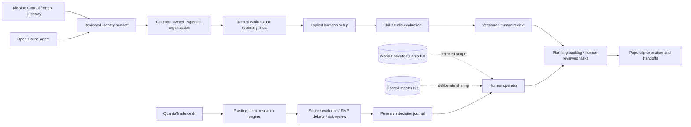

# Operator Work Zone and QuantaTrade

## Local installation

Paperclip source is cloned to `C:\Paperclip`. QuantaCore stays on port 3000; Paperclip is published only on loopback port 3210. Existing HarnessRouter, OpenMuse, OpenDots and memory services retain their ports.

Prepare ignored local service credentials, then start Paperclip and initialize its operator account:

```powershell
node scripts/setup-paperclip.mjs --prepare
node scripts/paperclip-compose.mjs up -d
node scripts/setup-paperclip.mjs
node scripts/initialize-workzones.mjs
docker logs --tail 100 quanta-paperclip
```

Open `http://127.0.0.1:3000/#/work-zone` or `http://127.0.0.1:3000/#/quantatrade`.

The image is pinned to official Paperclip version `2026.1001.0`, source revision `8f8a0ab7effbd6a0584107d8038736c134ee5047`, Linux AMD64 manifest `sha256:8462fc831df840f44a324f961180efd09939a6df125e4486dc63cf33be90937e`. Port 3210 is used inside and outside Docker so Paperclip's localhost authentication URL remains consistent. First startup applies the native database migrations and can take several minutes on this machine.

The initializer creates three build workers and thirteen QuantaTrade research workers, with reporting lines, one setup planning brief per organization and shared operator work rules. It is idempotent by worker name and brief title. Workers remain paused and no evaluation passes or research results are fabricated.

Paperclip data lives in the `quanta-paperclip_paperclip-data` Docker volume. Quanta mappings, KB notes, watchlists and review records live in ignored `.quanta/operator-workzones.json`. Back up both stores. Export workspace JSON from the UI for a portable record. The export does not include Paperclip's full task history or runtime secrets; back up the Docker volume separately.

## Local verification — 2026-10-03

- Paperclip authenticated/private service is running on loopback port 3210; its operator bootstrap completed.
- Work Zone: 3 paused workers, 1 backlog setup brief and 1 shared operator-rules note.
- QuantaTrade: 13 paused workers, 1 backlog setup brief and 1 shared operator-rules note.
- The local console session, native organization graph and Skill Studio were opened in the browser. Quanta onboarding exposes the supported harness choices and reporting lines.
- Frontend build and TypeScript checks passed. No test suite, model execution or financial transaction was run for this integration. Existing research health reports ready with one configured model; stored older runs include failures and are not new validation evidence.
- Worker adapters still require provider/tool setup and operator review. No training passes have been recorded. Hosted multi-user Paperclip membership integration remains a separate deployment step.

## Worker lifecycle

1. Create an operator organization in each zone.
2. Name a worker, define its role, choose a harness and assign a reporting line.
3. Workers start paused, with recurring and demand-triggered heartbeats disabled. If company hire approvals are enabled, the hire remains pending board approval.
4. Configure the worker adapter, model, instructions and narrowly scoped tools in Paperclip. Quanta does not copy saved provider keys into Paperclip.
5. Use Paperclip Skill Studio to author skills and run evaluations. Record the actual evidence reference and operator verdict in Training.
6. Save a planning brief to the backlog, with human review required. Review the task and adapter in Paperclip before deliberately activating a worker.
7. Use Paperclip tasks, checkout, comments and reporting lines for handoffs. Quanta displays the actual worker and task state.

A chosen harness is not a configured runtime. A training review is not model-weight training, certification or an automatic permission grant. Zero budget in Paperclip is not a guaranteed spending block; paused workers and disabled heartbeats prevent this integration from starting executions.

## Organization and identity boundaries

The browser never supplies the authoritative company ID or owner identity. The local bridge derives the operator from a verified Supabase token when present; otherwise the explicitly trusted loopback preview uses one `local-operator` identity. Build and trade zones get separate Paperclip companies. Worker assignment and reporting references must belong to the selected company.

This is a single-computer, trusted local deployment. Paperclip uses authenticated/private mode with a generated local operator account. The bridge authenticates its server requests; Connect console session installs an HttpOnly local operator session for the native console only in the explicit single local-operator preview. Verified Supabase users cannot receive that board session and must sign into Paperclip with their own memberships. The account has broad board access. Distinct companies and bridge scoping are not sufficient isolation for untrusted local users or hosted tenants. Deploy authenticated Paperclip with company memberships and an identity integration before offering production multi-user Work Zones. Vercel cannot run this Docker service or reach a user's loopback address. Hosted access to this bridge is rejected. No Docker socket or host-source directory is mounted. Telemetry is disabled. Generated account credentials, signing secrets, and recoverable connector keys use `.quanta/bootstrap-credentials.json`, encrypted through ProviderStore (Windows current-user DPAPI). The launcher decrypts the signing secret into the Docker process environment without writing a plaintext env file. Protect the Windows account, Docker access, and private Paperclip database.

## Knowledge model

Each worker has a private Quanta KB scope. The master KB is explicitly shared within that operator zone. Notes preserve source and timestamp. Private notes are not automatically injected into company-visible tasks or native harness prompts. The operator selects any content for a deliberate handoff. These notes are persisted locally; they are not automatically ingested into Hindsight, Honcho or Obsidian. An adapter that injects KB context must enforce the selected worker's private scope plus the master scope.

## QuantaTrade

QuantaTrade composes a stock-research desk: desk lead, evidence specialists, bull/bear debate, risk review and portfolio research. Its Research lab, Decision ledger and Evaluation views reuse the existing Quanta research engine, model configuration, budgets, evidence and run journal. Paperclip manages the human-authored worker organization and briefs; those worker IDs are not automatically substituted for research graph nodes.

Watchlists show stored research findings and timestamps, not live quotes. No prices, returns or track records are invented. Predictive value is unvalidated; historical evaluation is not a fill/slippage/fees backtest. No broker orders are submitted. Financial execution requires a separate authorized implementation and human approval.

## Sources

- https://github.com/paperclipai/paperclip
- https://docs.paperclip.ing/reference/deploy/docker/
- https://docs.paperclip.ing/reference/api/companies/
## Component flow



Open House and Agent Directory hand off only the chosen identity and role into the onboarding form. This requires an operator review and submission; no existing agent, KB or credential is silently migrated. The native Paperclip console uses a single trusted local operator account. For hosted tenant isolation, replace that account bridge with operator-specific memberships and sessions.

If Docker's registry DNS is unavailable, `node scripts/install-paperclip-image.mjs` streams the official Linux AMD64 OCI image through Windows, verifies every blob digest and imports an OCI archive into Docker. Cached blobs and the archive are ignored local artifacts. The helper never disables TLS validation. The Compose file can be pinned to the imported digest after successful installation.
